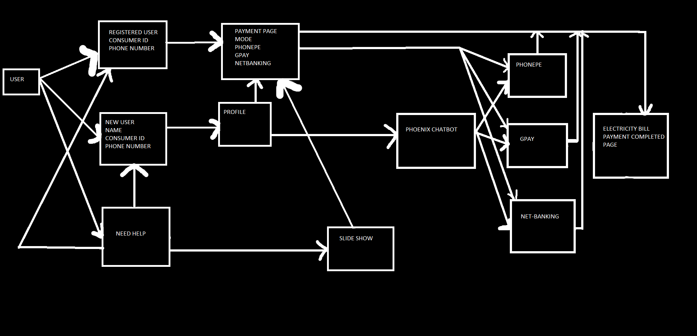

# 2021_IBM_Code_Challenge_paymentweb
Easy to use Electricity bill payment website application for elderly people

#### **CONTRIBUTORS :** 
Adithya TS  
Amrita J 
Anjana Anil 
Anusha Nair 
Rimitha Shajahan 

#### **COLLEGE :** LBS INSTITUTE OF TECHNOLOGY FOR WOMEN, TRIVANDRUM 

#### **PROBLEM STATEMENT :**  
Increased dependency on youngsters and adoloscents  for making payments. 
Small font size and icon size. 
Background contrast unsuitable for the eyes of elderly population. 
No proper guidance for making e-payment. 
                   
#### **PERSONA :** Elderly people

#### **ARCHITECTURE :**  

